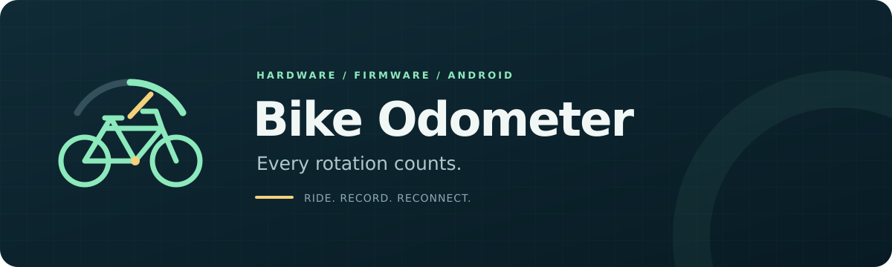

<p align="center">
  
</p>

<p align="center">
  <strong>A bicycle odometer with custom hardware, low-power firmware, and an Android companion app.</strong>
</p>

<p align="center">
  <a href="docs/user-manual.md"><strong>Read the user manual</strong></a> ·
  <a href="#inside-the-repository">Explore the project</a> ·
  <a href="#development">Start developing</a>
</p>

---

Bike Odometer turns wheel rotations into ride history. A magnetic sensor records
activity on the bicycle, and the **Bike Counter** app retrieves it over Bluetooth
Low Energy to show distances, trends, and individual trips.

Once the device's clock is set through the app, rides are recorded without a
continuous phone connection. Reconnect later to catch up on your activity.

## Made for everyday rides

| On the bicycle | On your phone |
| --- | --- |
| Automatic recording from wheel movement | Automatic Bluetooth sensor discovery |
| Five-minute activity intervals | Distance charts over 7 days, 30 days, or 12 months |
| Storage for the newest 3,000 completed trips | Trip history with distance, duration, and average speed |
| Low-power idle and bounded Bluetooth discovery windows | Wheel-size settings and battery readings |

Distance is calculated from rotations and wheel size. Time and average-speed
figures use five-minute recording intervals.

## Your first ride

1. Start with an assembled, powered device and the Bike Counter Android app.
2. Open the app with Bluetooth enabled, then rotate the wheel to wake discovery.
3. Select your sensor and set the correct wheel size. The app also sets the
   device's clock, which is required before trips can be stored.
4. Ride, then reconnect to view your activity in **Current** and **History**.

**[Continue to the user manual →](docs/user-manual.md)** for connection steps,
screen explanations, and troubleshooting. The manual is an initial draft;
hardware mounting instructions and app distribution details are still being
documented.

## How it works

```text
 Wheel magnet        Bike Odometer           Bike Counter
      ↻             sensor + firmware        Android app
      └──────────►  record & store  ── BLE ──►  view rides
```

The firmware counts sensor pulses and saves activity in nonvolatile memory.
Bluetooth transfers trip records to the app, which stores data locally and
calculates distances using the selected wheel size. Previously downloaded
activity can also be viewed from **Historical Devices**.

## Inside the repository

| Directory | What you'll find |
| --- | --- |
| [`hardware/`](hardware/) | KiCad schematic, PCB layout, symbols, and footprints |
| [`firmware/`](firmware/) | Zephyr / Nordic nRF Connect SDK firmware and the custom nRF54L10 board definition |
| [`android/`](android/) | Bike Counter app built with Svelte, TypeScript, and Capacitor, plus its backend workspace |
| [`docs/`](docs/) | User manual and project artwork |

The native Android project lives at [`android/android/`](android/android/).
The outer `android/` directory contains the complete companion-app project.

## Development

### Companion app

From the repository root, install dependencies with Bun and start the web UI:

```sh
cd android
bun install
bun run dev
```

For a local Android debug build and installation, use the existing script with
the Android SDK, Java, and an ADB-connected device configured:

```sh
bun run install-app-debug-local
```

See the [app README](android/README.md) for build and signing details. Backend
code lives in [`android/apps/backend/`](android/apps/backend/).

### Firmware

The firmware targets the custom
[`bike-odometer/nrf54l10/cpuapp` board](firmware/boards/LCD/bike-odometer/).
Use a Nordic nRF Connect SDK environment with this repository's board definitions.
Application sources are in [`firmware/src/`](firmware/src/); configuration starts
at [`firmware/prj.conf`](firmware/prj.conf).

The [BLE integration reference](firmware/docs/android-ble-spec.md) describes the
device characteristics and trip transfer protocol. Consult the current firmware
alongside it when implementing a client; some details in the reference may lag
the implementation.

### Hardware

Open [`hardware/bike-odometer.kicad_pro`](hardware/bike-odometer.kicad_pro) in KiCad
to explore the schematic and PCB. The repository's
[Export ECAD workflow](.github/workflows/generate-gerbers.yaml) generates hardware
exports using KiBot.

## Documentation

- **[User manual](docs/user-manual.md)** — setup, everyday use, and troubleshooting.
- **[App development](android/README.md)** — local builds and Android signing.
- **[BLE integration](firmware/docs/android-ble-spec.md)** — protocol reference for client developers.
- **[Project logo](docs/assets/logo.svg)** — scalable bicycle-and-gauge artwork.

## Licensing

| Directory | License |
| --- | --- |
| `hardware/` | [CERN-OHL-W-2.0](hardware/LICENSE) |
| `firmware/` | [GPL-3.0-or-later](firmware/LICENSE) |
| `android/` | [GPL-3.0-or-later](android/LICENSE) |
| `libraries/` | [LGPL-3.0-or-later](libraries/LICENSE) |
| `docs/` | [CC-BY-SA-4.0](docs/LICENSE) |

See [Project licensing](LICENSE.md) for scope and existing third-party notices.
